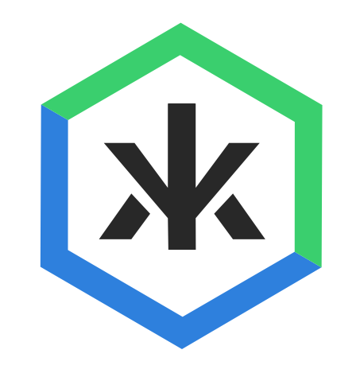

# Kredeum NFTs 

## Grants Round 9 Hackathon, March 2021 

## _[1st Prize with Polygon](https://twitter.com/0xPolygon/status/1382268280933535748)_

## _[IPFS Prize "Framework Support" with Protocal Labs](https://gitcoin.co/issue/protocol/grants/6/100025063)_

### WordPress pluging and Polygon Smart Contract enabling :

1/ archiving of WordPress medias (photos, images...) on IPFS

2/ minting these archived medias as NFTs on Polygon network (ex Matic)

3/ selling these minted NFTs on Arkane and OpenSea

**Join [Kredeum Team on Discord](https://discord.gg/6MbErhxs)**

Send [us an email : contact@kredeum.com](mailto:contact@kredeum.com)

Read [Kredeum NFTs documentation, installation and user guide](https://docs.kredeum.tech/)

Watch [Kredeum NFTs presentation on YouTube](https://www.youtube.com/watch?v=PWYbeLTXTKE)

Download [Kredeum NFTs WP plugin](https://github.com/Kredeum/gr9/releases/download/v0.2.13/KredeumNFTs_v0.2.13.zip)

Verify [Kredeum NFTs Smart Contract on Polygon](https://explorer-mainnet.maticvigil.com/address/0xF6d53C7e96696391Bb8e73bE75629B37439938AF/transactions)

Explore [Kredeum NFTs](https://kre.kredeum.tech)

Exchange [Kredeum NFTs on Opensea](https://opensea.io/collection/kredeum-nfts)

Discover [Kredeum NFTs indexed via The Graph](https://thegraph.com/explorer/subgraph/zapaz/kredeum-nft)
